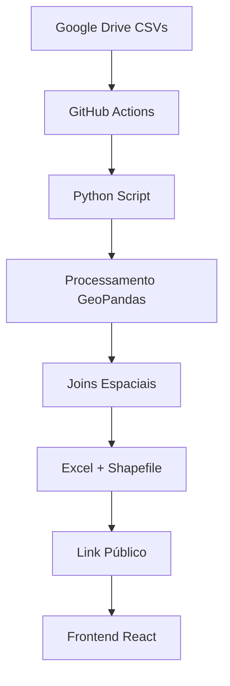

# 🔥 Focos de Calor - Maranhão

Sistema de monitoramento em tempo real dos focos de calor no estado do Maranhão, desenvolvido para o IMESC.

[](https://brunnosilllva.github.io/focos-de-calor)
[](https://reactjs.org)
[](https://python.org)
[](LICENSE)

## 🎯 Funcionalidades

### 📊 Seção 1 - Maranhão
- **Mapa interativo** com distribuição espacial dos focos
- **Cards estatísticos** (total focos, municípios, UCs, terras indígenas)
- **Top 5 municípios** com mais ocorrências
- **Análise por uso do solo** e biomas (Cerrado vs Amazônia)
- **Sistema de alertas** por nível de risco

### 🌎 Seção 2 - Brasil (Em desenvolvimento)
- Comparativo regional
- Ranking nacional dos estados
- Timeline evolutiva

### 🚀 Seção 3 - Preditiva (Em desenvolvimento)
- Dashboard de risco em tempo real
- Modelo de predição
- Integração com APIs meteorológicas

## 🛠️ Tecnologias

- **Frontend:** React.js + Tailwind CSS
- **Mapas:** D3.js com projeção geográfica customizada
- **Gráficos:** Recharts
- **Processamento:** Python + GeoPandas + Shapely
- **Automação:** GitHub Actions (execução a cada hora)
- **Deploy:** GitHub Pages

## 📁 Estrutura do Projeto

```
focos-de-calor/
├── .github/workflows/          # Automação GitHub Actions
│   └── process-heat-data.yml   # Pipeline de processamento
├── scripts/                    # Scripts Python de processamento
│   ├── process_focos_calor.py  # Script principal
│   └── requirements.txt        # Dependências Python
├── data/                       # Dados processados
│   └── current_data_link.json  # Link público gerado automaticamente
├── frontend/                   # Aplicação React
│   ├── public/
│   │   └── index.html
│   ├── src/
│   │   ├── components/
│   │   │   └── FocosCalorApp.js
│   │   ├── index.js
│   │   ├── index.css
│   │   └── App.js
│   ├── package.json
│   ├── tailwind.config.js
│   └── postcss.config.js
└── docs/                       # GitHub Pages (opcional)
```

## 🚀 Como Executar

### 1. Pré-requisitos
- Node.js 16+ 
- npm ou yarn
- Python 3.8+ (para processamento)

### 2. Instalação do Frontend

```bash
# Clone o repositório
git clone https://github.com/brunnosilllva/focos-de-calor.git
cd focos-de-calor

# Instalar dependências do frontend
cd frontend
npm install

# Executar aplicação em desenvolvimento
npm start
```

A aplicação estará disponível em `http://localhost:3000`

### 3. Configurar Processamento Automático

1. **Configurar credenciais do Google Drive:**
   - Criar service account no Google Cloud Console
   - Baixar arquivo JSON de credenciais
   - Adicionar aos secrets do GitHub: `GOOGLE_CREDENTIALS`

2. **Ativar GitHub Actions:**
   - O workflow roda automaticamente a cada hora
   - Processa dados do Google Drive
   - Atualiza arquivo público para o site

## 📊 Pipeline de Dados



1. **Coleta:** Scripts Python baixam CSVs do Google Drive
2. **Processamento:** Aplicação de joins espaciais (municípios, biomas, UCs)
3. **Qualificação:** Enriquecimento com dados de terras indígenas
4. **Exportação:** Geração de Excel e Shapefile atualizados
5. **Publicação:** Link público disponibilizado para o frontend

## 🔧 Configuração do GitHub Pages

```bash
# Na pasta frontend
npm run build
npm run deploy
```

**Configurar no GitHub:**
- Settings > Pages
- Source: gh-pages branch
- URL: https://brunnosilllva.github.io/focos-de-calor

## 📈 Roadmap

- [x] **Fase# 🔥 Focos de Calor - Maranhão

Sistema de monitoramento em tempo real dos focos de calor no estado do Maranhão, desenvolvido para o IMESC.

## 🎯 Funcionalidades

### 📊 Seção 1 - Maranhão
- **Mapa interativo** com distribuição espacial dos focos
- **Cards estatísticos** (total focos, municípios, UCs, terras indígenas)
- **Top 5 municípios** com mais ocorrências
- **Análise por uso do solo** e biomas
- **Sistema de alertas** por nível de risco

### 🌎 Seção 2 - Brasil (Em desenvolvimento)
- Comparativo regional
- Ranking nacional
- Timeline evolutiva

### 🚀 Seção 3 - Preditiva (Em desenvolvimento)
- Dashboard de risco em tempo real
- Modelo de predição
- Integração com APIs meteorológicas

## 🛠️ Tecnologias

- **Frontend:** React.js + Tailwind CSS
- **Mapas:** D3.js com projeção geográfica
- **Gráficos:** Recharts
- **Processamento:** Python + GeoPandas
- **Automação:** GitHub Actions
- **Deploy:** GitHub Pages

## 📁 Estrutura do Projeto

```
focos-calor-ma/
├── .github/workflows/          # Automação GitHub Actions
├── scripts/                    # Scripts Python de processamento
├── data/                       # Dados processados
├── frontend/                   # Aplicação React
│   ├── public/
│   ├── src/
│   │   ├── components/
│   │   └── ...
└── docs/                       # GitHub Pages
```

## 🚀 Como Executar

### 1. Pré-requisitos
- Node.js 16+ 
- npm ou yarn
- Python 3.8+ (para processamento)

### 2. Instalação

```bash
# Clone o repositório
git clone https://github.com/SEU_USUARIO/focos-calor-ma.git
cd focos-calor-ma

# Instalar dependências do frontend
cd frontend
npm install

# Executar aplicação
npm start
```

### 3. Configurar Processamento Automático

1. **Configurar credenciais do Google Drive:**
   - Criar service account no Google Cloud
   - Baixar JSON de credenciais
   - Adicionar aos secrets do GitHub: `GOOGLE_CREDENTIALS`

2. **Ativar GitHub Actions:**
   - O workflow roda automaticamente a cada hora
   - Processa dados do Google Drive
   - Atualiza arquivo público para o site

## 📊 Pipeline de Dados

1. **Coleta:** Scripts Python baixam CSVs do Google Drive
2. **Processamento:** Aplicação de joins espaciais (municípios, biomas, UCs)
3. **Qualificação:** Enriquecimento com dados de terras indígenas
4. **Exportação:** Geração de Excel e Shapefile atualizados
5. **Publicação:** Link público disponibilizado para o frontend

## 🔧 Configuração do GitHub Pages

1. **Configurar repositório:**
   ```bash
   # Instalar gh-pages
   npm install --save-dev gh-pages
   
   # Deploy
   npm run deploy
   ```

2. **Configurar GitHub Pages:**
   - Ir em Settings > Pages
   - Source: gh-pages branch
   - URL: https://SEU_USUARIO.github.io/focos-calor-ma

## 📈 Roadmap

- [x] **Fase 1:** MVP Seção Maranhão
- [ ] **Fase 2:** Seção Brasil + comparativos
- [ ] **Fase 3:** Dashboard preditivo
- [ ] **Fase 4:** Alertas automáticos

## 🤝 Contribuição

1. Fork o projeto
2. Crie uma branch (`git checkout -b feature/nova-funcionalidade`)
3. Commit suas mudanças (`git commit -m 'Adiciona nova funcionalidade'`)
4. Push para a branch (`git push origin feature/nova-funcionalidade`)
5. Abra um Pull Request

## 📝 Licença

Este projeto está sob licença MIT. Veja o arquivo [LICENSE](LICENSE) para detalhes.

## 📞 Contato

- **Desenvolvido para:** IMESC - Instituto Maranhense de Estudos Socioeconômicos e Cartográficos
- **Fonte dos dados:** INPE - Instituto Nacional de Pesquisas Espaciais

---

**🔥 Monitoramento ambiental inteligente para o Maranhão**
